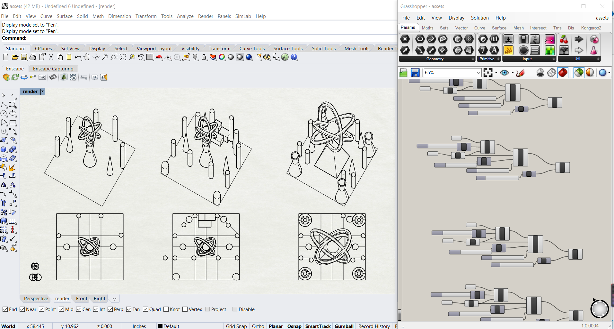
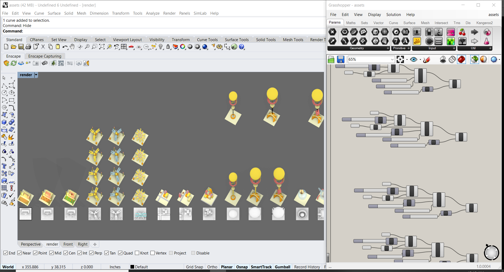
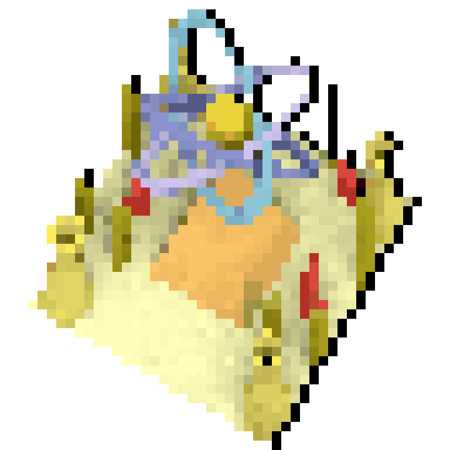
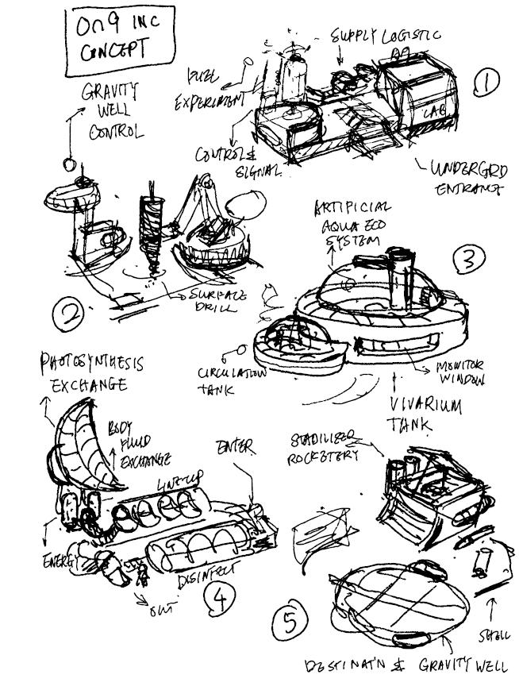
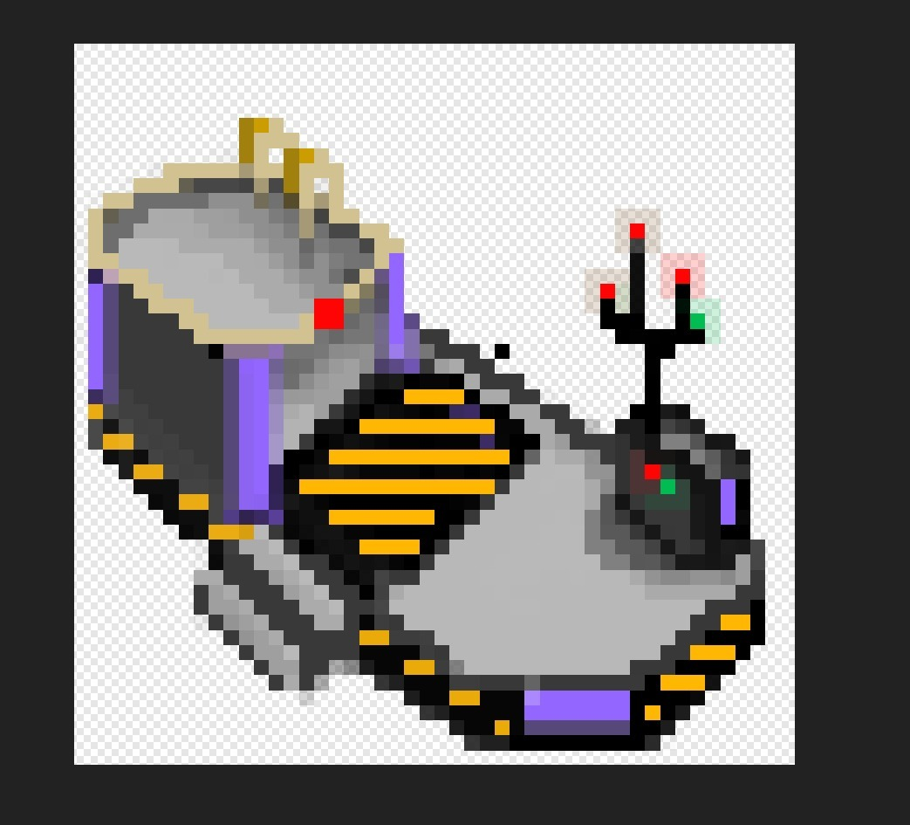
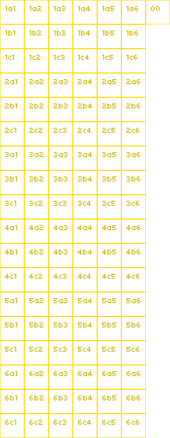
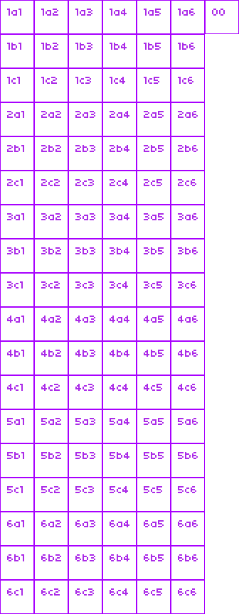

# Game-Off-2020 Project
[Game Off 2020](https://itch.io/jam/game-off-2020) is an annual game jam, where participants spend the month of November creating games based on a secret theme. Participate individually, or as a team. Use whatever game engines, libraries, and languages you like.

The theme for this year’s Game Off is **MOONSHOT**.

This game was created in November 2020 as an entry to the **itch.io and Github Game Jam: Game Off 2020**
-   [Game Jam Link](https://itch.io/jam/game-off-2020)
-   [Entry Link](https://itch.io/jam/game-off-2020/rate/836823)
-   [Itch.io Game Page](https://jazorhe.itch.io/moon-heist)
-   [Github Repository (this page)](https://github.com/jazorhe/Game-Off-2020)

# GD50 Final Project
This game was also treated as my **Final Project for the Game Development Open Course GD50** hosted by the Havard University and the Havard Extension School.
-   [CS50 Channel](https://www.youtube.com/user/cs50tv)
-   [GD50 Playlist](https://www.youtube.com/playlist?list=PLhQjrBD2T383Vx9-4vJYFsJbvZ_D17Qzh)
-   [GD50 2018 (I used this version)](https://cs50.harvard.edu/games/2018/)
-   [GD50 2020](https://cs50.harvard.edu/extension/games/2020/fall/)

Thanks to these two awesome teachers:
-   [David J. Malan](https://cs.harvard.edu/malan/)
-   [Colton Ogden](https://www.linkedin.com/in/colton-ogden-0514029b/)

See below [**Specification for GD50 Final Project**](https://github.com/jazorhe/Game-Off-2020#specification-for-gd50-final-project) for project submission.


## Contents:
-   [Basic Information](https://github.com/jazorhe/Game-Off-2020#basic-information)
-   [Concept](https://github.com/jazorhe/Game-Off-2020#concept)
-   [Core Gameplay](https://github.com/jazorhe/Game-Off-2020#core-gameplay)
-   [Winning/Losing Conditions](https://github.com/jazorhe/Game-Off-2020#winninglosing-conditions)
-   [Asset List](https://github.com/jazorhe/Game-Off-2020#asset-list)
    -   Graphical
    -   Audio
-   [Art Style](https://github.com/jazorhe/Game-Off-2020#art-style)
    -   Yellow
    -   Purple
-   [Data[ Structure & Balancing](https://github.com/jazorhe/Game-Off-2020#data-structure--balancing)
-   [Development](https://github.com/jazorhe/Game-Off-2020#development)
    -   Sprites
    -   Isometric Hovering
    -   Data Driven Design
    -   Game Events
    -   States
    -   Debugging
-   [Specification for GD50 Final Project](https://github.com/jazorhe/Game-Off-2020#specification-for-gd50-final-project)
-   [Credits](https://github.com/jazorhe/Game-Off-2020#credits)
-   [Licenses](https://github.com/jazorhe/Game-Off-2020#licenses)
-   [Resources](https://github.com/jazorhe/Game-Off-2020#resources)
-   [Change Logs](https://github.com/jazorhe/Game-Off-2020#change-log)


## Moon Heist
### Basic information:
-   **Genre**: Strategy, Management, Simulation
-   **Playable Platform**: Windows, HTML
-   **Time For Single Playthrough**: 5-10 minutes


### Concept:
The player is sent to the Moon and is in charge of the latest space project: ***The International Moon Base***, funded by the ***International Space association*** (temp name).

The player is also secretly employed by a giant science/technology company ***Tesla*** (temp name), which secretly demanded the player to construct a hidden secondary moon base, and its final attempt is to steal the moon for unknown reason.


Initial Concept Diagram:


### Core Gameplay
The core gameplay of this concept consists the following:
-   **Facilities Management:** There are 6 facilities on each side, all facilities are upgradable. Max level at level 3 for all facilities. The end goal of the game is to achieve level 3 for facility No.6 of either side of power. The player gets to choose which side he/her would desire to help.
-   **Resource Management:** There are 4 types of resources in the game. Each term the facilities will earn/cost some resources. Player needs to maintain his/her resource level above 0 while also have enough to upgrade the goal facility.
-   **Time Management:** Player needs to achieve the end goal for one side within a certain number of turns (18).
-   **Trust Management:** There is also trust specifically for the *Government* side. The player needs to keep this value above 0. The current level of trust can effect the earning (or other things) in the game.
-   **Random Events:** There are pools for random events in this game. Every few terms a random event will appear, asking the player to make a choice. These choices will resolve in resource changes, trust changes or possibly some other effects.


### Winning/Losing Conditions
There are following winning conditions:
-   Upgrading the No.6 facility for the yellow side to reach the yellow ending
-   Upgrading the No.6 facility for the purple side to reach the purple ending

There are following losing conditions:
-   Time exceeds 18 months (turns)
-   Any one or more of the 4 resources drop below 0
-   Trust level on the yellow side drops below 0

### Asset List
#### Graphical
-   Left side facilities (6 facilities, 3 levels, multiple frames)
-   Right side facilities (6 facilities, 3 levels, multiple frames)
-   Background images
-   UI boxes and icons
-   Event images
-   Start screen, Ending screens
-   Cutscenes
-   Game icon

#### Music & Sound Effect
-   Main theme
-   Left side theme
-   Right side theme
-   Ending sound design
-   Other sound effects


## Art Style
We decided with yellow-purple as the theme colours.

### Yellow (Rhoda)
Yellow side art is achieved by using the following tools:
-   Rhino: 3D modelling
-   Grasshopper: Transformations and export png
-   Pixelator: Pixelation
-   Housemade Python Script: Adjusting pixel art to required size
-   Photoshop: Adjustments and Animation frames


Yellow Side Models:


<br>
<br>

Yellow Side Product:

<br>

Detailed Product:




### Purple (Toothless)
Purple side art is achieved by using the following tools:
-   reMarkable Paper Tablet: Drafting
-   Serif Affinity Photo: Translate drafts into coloured hand drawings
-   Serif Affinity Photo: Pixel art creation and Animation frames


Purple Side Drafts:




Purple Side Model:




## Data Structure & Balancing
[Numeric System Design Spreadsheet](https://docs.google.com/spreadsheets/d/1_NTowgmsGuZVGE5H6L1Hs_r6AtO24pWrbx5FGaMPeys/edit?usp=sharing)


## Development:
### Contents
-   Sprites
-   Isometric Hovering
-   Data Driven Design
-   Game Events
-   States
-   Debugging

### Sprites




<br>

### Isometric Hovering

```lua
function Facility:isHovered()
    -- This function has been achieved using very specific trigonometry for our prites. Our sprites are 30-60 degrees and when handling hover actions, because of the transparent space around the sprite, multiple sprites are thought to be selected. The hover action has been handled within the Facility class for decomposition purposes, thus I would not want to handle hovering in higher level classes with layering functions just to for this puposes. Thus I went with a more complex approach. Might not be the best to do.
    if mouseX > self.x + self.offsetX and mouseX < self.x + self.offsetX + FACILITY_SIZE * 2 then
        if mouseY > self.y + self.offsetY and mouseY < self.y + self.offsetY + FACILITY_SIZE * 2 then

            -- exclude top left corner
            if (mouseY - self.y - self.offsetY) < - math.sqrt(3) * (mouseX - self.x - self.offsetX) + math.sqrt(3) / (math.sqrt(3) + 1) * 96 + 10 then
                return false
            end

            -- exclude top right corner
            if (mouseY - self.y - self.offsetY) < 1 / math.sqrt(3) * (mouseX - self.x - self.offsetX) - 1 / (math.sqrt(3) + 3) * 96 + 10 then
                return false
            end

            -- exclude bottom left corner
            if (mouseY - self.y - self.offsetY) > 1 / math.sqrt(3) * (mouseX - self.x - self.offsetX) + math.sqrt(3) / (math.sqrt(3) + 1) * 96 - 10 then
                return false
            end

            -- exclude bottom right corner
            if (mouseY - self.y - self.offsetY) > - math.sqrt(3) * (mouseX - self.x - self.offsetX) + (math.sqrt(3) + 4) / (math.sqrt(3) + 1) * 96 - 10 then
                return false
            end

            return true
        end
    end
    return false
end
```

### Data Driven Design

### Game Event Design
Game Event Types:
-   Regular: planned events that will definitely happen at turns
-   Random: a pool of events that will be randomly chosen at start game

Game Events should have the folling states:
-   planned
-   encounter
-   progressing
-   resolve
-   passed

When looping the GameEvents table in PlayState, the following should be the looping order:

for game event in table
    if state is progressing
        if resolve turn is this turn
        change state to resolve

for game event in table
    if state is resolve
        resolve event
        change state to passed

for game event in table
    if state is planned
        if encounter turn is this turn
            change state to encounter

for game event is table
    if state is encounter
        encounter event
        change state to progressing


Game Events data structure design:
-   encounter: turn number for encountering this event
-   resolve: turn number for resolving this event
-   `dialogues[0]`: Encountering event dialogues
-   `dialogues[1]`: Choice 1 at encountering
-   `dialogues[2]`: Choice 2 at encountering
-   `dialogues[3]`: Resolving event dialogues
-   `selections`: 2 Choices which will result in 2 different outcomes
-   `outcomes[1]`: Outcome related to choice 1, with resource change and trust change
-   `outcomes[2]`: Outcome related to choice 2, with resource change and trust change

I have decided to generate all events at start of turn 1, rather than at each turn decide if an event should be added. Generating order is as following:

-   Random Events Yellow Side
-   Random Events Purple Side
-   Regular Events Yellow Side
-   Regular Events Purple Side

Thus, When resolving or encountering events, random events always come before regular ones.

### Game States
This game the following game states managed with a *StateStack*:
-   StartState
-   CreditsState
-   PlayStates
-   FadeInState
-   FadeOutState
-   PauseState
-   TutorialState
-   NewTurnTransitionState
-   GameEventDisplayState
-   DialogueState
-   GameOverState
-   YellowEndingState
-   PurpleEndingState
-   DebugOptionsState

### Debugging

### Specification for GD50 Final Project
1.  Your game must be in either LÖVE or Unity.

    **This game was made with LÖVE.**

2.  Your game must be a cohesive start-to-finish experience for the user; the game should boot up, allow the user to play toward some end goal, and feature a means of quitting the game.

    **This game has a cohesive start-to-finish experience for the user, refer to [Core Gamplay](https://github.com/jazorhe/Game-Off-2020#core-gameplay).**

3.  Your game should have at least three GameStates to separate the flow of your game’s user experience, even if it’s as simple as a StartState, a PlayState, and an EndState, though you’re encouraged to implement more as needed to suit a more robust game experience (e.g., a fantasy game with a MenuState or even a separate CombatState).

    **This game has 14 game states, refer to [Game States](https://github.com/jazorhe/Game-Off-2020#game-states).**

4.  Your game can be most any genre you’d like, though there needs to be a definitive way of winning (or at least scoring indefinitely) and losing the game, be it against the computer or another player. This can take many forms; some loss conditions could be running out of time in a puzzle game, being slain by monsters in an RPG, and so on, while some winning conditions may be defeating a final boss in an RPG, making it to the end of a series of levels in a platformer, and tallying score in a puzzle game until it becomes impossible to do more.

    **This game has 14 game states, refer to [Winning/Losing Conditions](https://github.com/jazorhe/Game-Off-2020#winninglosing-conditions).**

5.  You are allowed to use libraries and assets in either game development environment, but the bulk of your game’s logic must be handwritten (i.e., putting together an RPG in Unity while using a UI library would be considered valid, assuming the bulk of the game logic is also not implemented in a library, but recycling a near-complete game prototype from Unity’s asset store with slightly changed labels, materials, etc. would not be acceptable).

    **The bulk logic of this game has been handwritten**<br>
    Library used for this game:
    -   [Lua Knife](https://github.com/airstruck/knife)
    -   [Push Module for Lua](https://github.com/Ulydev/push)

6.  Your project must be at least as complex as (and distinct from!) the games you’ve implemented in this course, and should really be moreso. Submissions of low complexity may be rejected! You must explain your game in detail and why you believe it to meet the complexity and distinctiveness requirement in a README.md file at the root of your project.

    **This game is a lot more complex than any projects made in this course because of the following reasons:**

    -   **Variables**: This game keeps track a large amount of Variables including 4 resources, 2 trust levels for 2 playable sides. Each has 6 facilities with 3 upgradable states.
    -   **Turn (Time) System**: This game has a turn (time) system, for each turn, each facility on each side, depending on their levels, will gain different earnings for the player.
    -   **Animations**: All Facilities have their animations for 3 different levels.
    -   **Background**: There are images and other animations elements in the background.
    -   **Game States**: This game has more than 14 game states.
    -   **Random Events**: This game has a random event system, where there are 2 pools of random events, for the earlier part and the later part of the game, each play-through, a number of events will be picked from the pool and presented to the player.
    -   **Mouse Control**: This game can be played with only a mouse. In one playable side, I needed to implement ***isometric hovering***.
    -   **Data Driven Design**: This game has implemented data driven design described in course for all dialogues, all facilities, all game events, all misc entities, all colours used, and all debugging options.
    -   **Shader**: This game uses similar shader effect as taught by the course, I made some slight adjustments.
    -   **Tweening**: This game has a lot of tweening effects in state transitions, sound design, and UI elements.
    -   **User Interface**: This game has a more complex UI representation compared to what has been taught in the course, and some UI elements need to be interactive (random events).
    -   **Particle System**: This game has a particle system to generate stars at random positions but with regular blinking actions in the background with different colours for both sides.
    -   **Sound Design**: This game has used soundtracks as part of the gameplay experience, when switching sides, the music switches smoothly (achieved with tweening using Knife).
    -   **Events**: This game uses events to manage resources, trusts across different states and also to assist with evaluating winning/losing.
    -   **Selections**: All random events and other selections in this game has *callback* functions that are organically combined with the data driven design, events and sound design and debugging.
    -   **Transitions**: This game used more transition methods upon what has been taught in course.
    -   **Debugging**: This game has a debug menu (hidden) that can assist the developer (myself) and improve efficiency.
    -   **Distribution**: This game has been distributed for both Windows and HTML versions, third party tools were required to change icons, export html, and I also needed to made adjustments to the html and css codes to improve the look and stability.
    -   **Collaboration**: This project requires working with others, I have gathered a team and together we planned, executed and published the game.
    -   **Project Management**: The project's scale is not small for a one month Game Jam, there are a lot of assets (graphical, audio) to be created. A lot of adjustments were made upon the original scope along the way. I was handling project management myself and it has been a great challenge for closing off this year.

    Overall, I have used everything been taught in the course to achieve this project while I have gone into more depth in each topic. I am very comfortable creating any genre of 2d games using LÖVE again.


## Credits
Our team has 4 members:
-   Graphical Effects: **Toothless Frostiana**
-   Graphical Effects: **Rhoda Du**
-   Game Development: **Jazor He**
-   Music Production: **Adam Chen**
-   Special Thanks To: **Olivia Deng**

## Licenses:
-   Code: MIT license (A short, permissive software license. Basically, you can do whatever you want as long as you include the original copyright and license notice in any copy of the software/source. There are many variations of this license in use. — tldrlegal.com)
-   Assets: Creative Commons Attribution_nonCommercial_NoDerivatives v4.0 International (This license forbids adaptations of your work to be shared in any way, and also forbids commercial uses of your work. This is not a Free Culture License. — creativecommons.org)


## Resources:
-   [LÖVE2d](https://love2d.org/wiki/love)
-   [Lua Knife](https://github.com/airstruck/knife)
-   [Push Module for Lua](https://github.com/Ulydev/push)
-   [Fonts: Dafont.com](https://www.dafont.com/)
-   [Sound Effects: Bfxr Sound Effect Generator](https://www.bfxr.net/)
-   [Shader](https://www.shadertoy.com/)
-   Markdown Guides:
    -   [Embed youtube to markdown, GitLab, GitHub](http://embedyoutube.org/)
    -   [GitHub: Mastering Markdown](https://guides.github.com/features/mastering-markdown/)
    -   [Markdown Emoji Cheatsheet](https://github.com/ikatyang/emoji-cheat-sheet/blob/master/README.md)
-   Books and Materials:
    -   [How to Make an RPG](https://howtomakeanrpg.com/)

## Change Logs
-   Ver 0.0.1
-   Ver 0.0.2
-   Ver 0.0.3
-   Ver 0.0.4
-   Ver 0.0.5
-   Ver 0.0.6
-   Ver 0.0.7
-   Ver 0.0.8
-   Ver 0.1.0
-   Ver 0.1.1
-   Ver 0.1.2
-   Ver 0.1.3
-   Ver 0.2.0
-   Ver 0.2.1
-   Ver 0.2.2
-   Ver 0.2.3
-   Ver 0.2.4
-   Ver 0.2.5
-   Ver 0.2.6
-   Ver 0.2.7
-   Ver 0.3.0
-   Ver 0.3.1
-   Ver 0.3.2
-   Ver 0.3.3
-   Ver 0.3.4
-   Ver 0.3.5
-   Ver 0.3.6
-   Ver 0.4.0
-   Ver 0.4.1
-   Ver 0.4.2
-   Ver 0.4.3
-   Ver 0.4.4
-   Ver 0.4.5
-   Ver 0.4.6
-   Ver 0.4.7
-   Ver 0.4.8
-   Ver 0.5.0
-   Ver 0.5.1
-   Ver 0.5.2
-   Ver 0.5.3
-   Ver 0.5.4
-   Ver 0.5.5
-   Ver 0.6.0
-   Ver 0.6.0a
-   Ver 0.6.1
-   Ver 1.0.0
-   Ver 1.0.1 Moon Heist
    -   Typo in tutorial
    -   Credit page titles changed from "Art Production" to "Graphical Effects"
-   Ver 1.0.2
-   Ver 1.0.3
-   Ver 1.0.4
-   Ver 1.0.5
-   Ver 1.0.6
-   Ver 1.0.7
-   Ver 1.0.8
