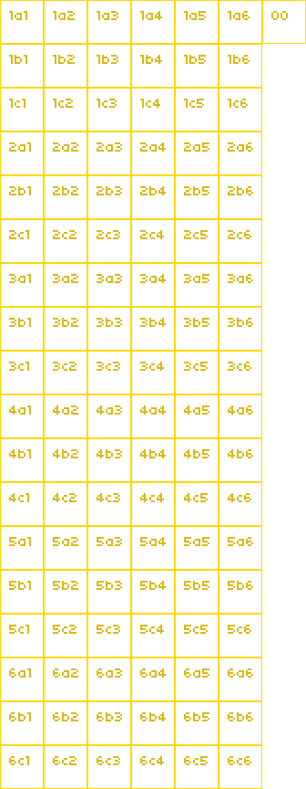

# Game-Off-2020

[Game Off 2020](https://itch.io/jam/game-off-2020) is an annual game jam, where participants spend the month of November creating games based on a secret theme. Participate individually, or as a team. Use whatever game engines, libraries, and languages you like.

The theme for this year’s Game Off is **MOONSHOT**.

Our team initially consists of 4 members:
-   **Adam Shi Chen**: Music Composing
-   **Rhoda Honglin Du**: Art Design
-   **Jazor Jiehao He**: Game Development
-   **Cypress Bolan Li**: Art Design


## Concept: Moon Heist

The player is sent to the Moon and is in charge of the latest space project: ***The International Moon Base***, funded by the ***International Space association*** (transient name). The player is also secretly employed by a giant science/technology company ***Tesla***, which secretly demanded the player to construct a hidden secondary moon base, and its final attempt is to steal the moon for unknown reason.


## Art Style

## Data Structure

## Balancing


## Dev Log:
### Sprite Structure:




<br>

### "Isometric-like" tiles hovering:

```lua
function Facility:isHovered()
    -- This function has been achieved using very specific trigonometry for our prites. Our sprites are 30-60 degrees and when handling hover actions, because of the transparent space around the sprite, multiple sprites are thought to be selected. The hover action has been handled within the Facility class for decomposition purposes, thus I would not want to handle hovering in higher level classes with layering functions just to for this puposes. Thus I went with a more complex approach. Might not be the best to do.
    if mouseX > self.x + self.offsetX and mouseX < self.x + self.offsetX + FACILITY_SIZE * 2 then
        if mouseY > self.y + self.offsetY and mouseY < self.y + self.offsetY + FACILITY_SIZE * 2 then

            -- exclude top left corner
            if (mouseY - self.y - self.offsetY) < - math.sqrt(3) * (mouseX - self.x - self.offsetX) + math.sqrt(3) / (math.sqrt(3) + 1) * 96 + 10 then
                return false
            end

            -- exclude top right corner
            if (mouseY - self.y - self.offsetY) < 1 / math.sqrt(3) * (mouseX - self.x - self.offsetX) - 1 / (math.sqrt(3) + 3) * 96 + 10 then
                return false
            end

            -- exclude bottom left corner
            if (mouseY - self.y - self.offsetY) > 1 / math.sqrt(3) * (mouseX - self.x - self.offsetX) + math.sqrt(3) / (math.sqrt(3) + 1) * 96 - 10 then
                return false
            end

            -- exclude bottom right corner
            if (mouseY - self.y - self.offsetY) > - math.sqrt(3) * (mouseX - self.x - self.offsetX) + (math.sqrt(3) + 4) / (math.sqrt(3) + 1) * 96 - 10 then
                return false
            end

            return true
        end
    end
    return false
end
```

### Game Events Design
Game Event Types:
-   Regular: planned events that will definitely happen at turns
-   Random: a pool of events that will be randomly chosen at start game

Game Events should have the folling states:
-   planned
-   encounter
-   progressing
-   resolve
-   passed

When looping the GameEvents table in PlayState, the following should be the looping order:

for game event in table
    if state is progressing
        if resolve turn is this turn
        change state to resolve

for game event in table
    if state is resolve
        resolve event
        change state to passed

for game event in table
    if state is planned
        if encounter turn is this turn
            change state to encounter

for game event is table
    if state is encounter
        encounter event
        change state to progressing


Game Events data structure design:
-   encounter: turn number for encountering this event
-   resolve: turn number for resolving this event
-   `dialogues[0]`: Encountering event dialogues
-   `dialogues[1]`: Choice 1 at encountering
-   `dialogues[2]`: Choice 2 at encountering
-   `dialogues[3]`: Resolving event dialogues
-   `selections`: 2 Choices which will result in 2 different outcomes
-   `outcomes[1]`: Outcome related to choice 1, with resource change and trust change
-   `outcomes[2]`: Outcome related to choice 2, with resource change and trust change

I have decided to generate all events at start of turn 1, rather than at each turn decide if an event should be added. Generating order is as following:

-   Random Events Yellow Side
-   Random Events Purple Side
-   Regular Events Yellow Side
-   Regular Events Purple Side

Thus, When resolving or encountering events, random events always come before regular ones.


## Todo List
-   [x] 背景图设计
-   [x] UI
    -   [x] 状态显示
    -   [x] 升级按钮及花费
    -   [x] 转场按钮
    -   [x] 回合按钮

-   [x] 事件生成
-   [x] 事件概率
-   [x] Stars
-   [x] Start Screen
-   [x Credit Screen
-   [x] Frame 7 for Facility 6
-   [x] Lost Text
-   [x] Win Game Animation
-   [ ] Lost Evaluation
-   [ ] More Events
-   [ ] Purple Facilities Positons
-   [ ] Purple Facilities Hovering
-   [ ] Purple Facilities Panels
-   [ ] Purple RGB
-   [ ] Purple 6 Grid
-   [ ] Purple Credit 640x360

## Known Issues
-   [x] Love2d on Windows misbehaving
Sub-pixel rendering issue

-   [x] Shifting error
-   [x] Mouse + keyboard
-   [x] hovering is triggering other side
-   [x] Restart Game does not restart PlayState
issue fixed: current turn confusion

starting a new game multiple times will cause consusion to turns, reason being event 'next turn' has been duplicated when a new game has been started. And when event is dispatched, multiple duplicants will be called.
-   [x] Still need work on only allowing one facility to be hovered at a time
-   [x] Sometimes event resolve does not have indication
-   [x] Shifting side in tutorial shows all display panel weirdly


## Special Thanks To:
-   Olivia Chuyi Deng


## Useful Links:
-   [LÖVE2d](https://love2d.org/wiki/love)
-   [Lua Knife](https://github.com/airstruck/knife)
-   [Push Module for Lua](https://github.com/Ulydev/push)
-   [Fonts: Dafont.com](https://www.dafont.com/)
-   [Freely Available Game Assets: Open Game Art](https://opengameart.org/)
-   [Sound Effects: Bfxr Sound Effect Generator](https://www.bfxr.net/)
-   [Shader](https://www.shadertoy.com/)
-   Markdown Guides:
    -   [Embed youtube to markdown, GitLab, GitHub](http://embedyoutube.org/)
    -   [GitHub: Mastering Markdown](https://guides.github.com/features/mastering-markdown/)
    -   [Markdown Emoji Cheatsheet](https://github.com/ikatyang/emoji-cheat-sheet/blob/master/README.md)
-   Books and Materials:
    -   [How to Make an RPG](https://howtomakeanrpg.com/)
